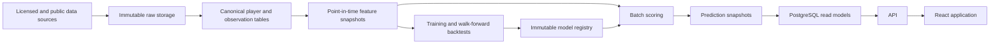

# Baseball Oracle Architecture

## Current State

The repository is a greenfield React 19 and TypeScript application built with Vite. It currently includes Lucide icons, Recharts, Oxlint, and Vitest/testing-library dependencies. There is no backend, database, data contract, authentication system, or established domain structure yet.

The architecture should preserve the speed of the current single-page app while establishing boundaries that can later support Python modeling and durable point-in-time data. The prototype should not require a distributed system.

## Architectural Priorities

1. Preserve the exact information vintage behind every prediction and decision.
2. Keep the UI independent of whether data comes from fixtures, a local file, or an API.
3. Train and score offline; serve immutable prediction snapshots to the product.
4. Separate raw observations, canonical baseball records, features, models, and product projections.
5. Treat model definitions and feature definitions as versioned contracts.
6. Start with the smallest deployable system and split services only when data volume or team ownership requires it.

## Phased Topology

### Phase A: Client Prototype

Keep the existing Vite application as one deployable unit.

```text
React views
    -> domain selectors and formatters
    -> PlayerRepository interface
    -> typed demonstration snapshots
    -> localStorage watchlist repository
```

Recommended frontend boundaries:

```text
src/
  app/                 application shell and view selection/routing
  components/          shared presentational components
  features/
    board/             filtering, sorting, table, comparison selection
    player/            dossier, charts, drivers, snapshot changes
    watchlist/         thesis and review workflow
    model-lab/         validation and provenance display
  domain/              shared types, units, forecast semantics
  data/                repository interfaces and demo implementation
  lib/                 generic utilities only
```

Feature modules may remain in one file during the earliest visual pass, but domain types and repository interfaces should be extracted before live data is introduced. Components should consume a `PlayerDossier` view model rather than importing fixture arrays directly.

### Phase B: Baseline Data And Modeling

Add an offline Python workspace and a thin read API. A practical target layout is:

```text
apps/web/              existing React/Vite application when moved into a workspace
services/api/          read API and authenticated product writes
services/modeling/     ingestion, feature generation, training, scoring, backtests
packages/contracts/    schemas and generated TypeScript client/types
infra/                 deployment, migrations, and scheduled-job definitions
```

Do not move the current app into a monorepo merely for appearance. Make that change when the first backend or modeling package is introduced.

Production data flow:



Suggested storage roles:

- Object storage plus partitioned Parquet for immutable raw inputs, historical observations, features, and research datasets
- DuckDB for local research and reproducible batch transforms during the early phases
- PostgreSQL for canonical identifiers, current product read models, prediction metadata, users, watchlists, and notes
- An artifact store for serialized models, environment metadata, and validation reports

PostgreSQL can serve the first production release without a separate warehouse. Add workflow orchestration, a managed warehouse, streaming, or a dedicated feature store only after measured scale warrants them.

### Phase C: Continuous Platform

Introduce scheduled orchestration for ingestion, quality checks, feature generation, scoring, and publishing. Each run should be idempotent and produce a run manifest. Prediction publishing is atomic: either the full validated snapshot becomes available or the previous snapshot remains current.

At this stage, add:

- Source freshness and schema-drift monitoring
- Model and feature drift reports
- Account-backed watchlists and saved screens
- Material-change notifications
- Experiment tracking and model promotion gates
- Role-based access if proprietary data is introduced

### Phase D: Market Intelligence

Market observations live in their own bounded context. Card identity, set, year, variant, grade, population, venue, fees, and liquidity do not belong in player-performance tables. Investment projections join a versioned baseball prediction snapshot to a versioned market snapshot so the decision can be reproduced later.

## Point-In-Time Data Model

Point-in-time correctness is the central architecture constraint. A forecast cannot be trusted if a feature contains information that became known after its stated as-of date.

Every observation should carry at least:

- `effective_at`: when the baseball event or state applied
- `observed_at`: when the source made it available to the system
- `ingested_at`: when Baseball Oracle stored it
- `source` and `source_record_id`
- `source_version` or content checksum

Use bitemporal semantics where corrections matter. A corrected stat can have the same effective date but a later observed date. Historical reconstruction must select the version that was knowable at the requested as-of timestamp.

### Core Entities

- `Player`: canonical internal identity and stable biographical attributes
- `ExternalPlayerId`: source-specific identifier crosswalk with effective dates
- `OrganizationAssignment`: team, affiliate, league, level, role, and effective interval
- `StatObservation`: source-grain batting, pitching, fielding, tracking, or event observation
- `AvailabilityObservation`: roster, injury, transaction, and playing-status observation
- `FeatureSnapshot`: immutable player feature vector at an as-of timestamp
- `OutcomeLabel`: target definition, evaluation horizon, value, and label-availability date
- `ModelRun`: model, training window, code revision, data manifest, metrics, and artifact location
- `PredictionSnapshot`: immutable model output for one player and as-of timestamp
- `ComparableSnapshot`: stage-matched comparison set tied to a prediction snapshot
- `Watchlist` and `WatchlistItem`: user research state tied to the prediction seen at decision time
- `MarketObservation`: later bounded context for collectible price and liquidity evidence

### Prediction Snapshot Contract

A prediction snapshot is append-only. Corrections create a new snapshot and never mutate a forecast that informed a previous decision.

```ts
type PredictionSnapshot = {
  id: string
  playerId: string
  asOf: string
  generatedAt: string
  modelVersion: string
  featureSetVersion: string
  dataManifestId: string
  playerType: 'hitter' | 'pitcher'
  eligibility: {
    hasDebuted: boolean
    currentLevel: string
  }
  arrival: {
    probabilityBy1Year: number
    probabilityBy3Years: number
    probabilityBy5Years: number
    expectedDebutWindow?: { from: string; to: string }
  }
  career: {
    conditionalOnDebut: boolean
    seasonQuantiles: Array<{
      season: number
      p10: number
      p50: number
      p90: number
    }>
    careerWar: { p10: number; p50: number; p90: number }
    milestoneProbabilities: Record<string, number>
  }
  reliability: {
    forecastConfidence: 'low' | 'medium' | 'high'
    dataCoverage: number
    missingFeatureGroups: string[]
    warnings: string[]
  }
  drivers: Array<{
    feature: string
    direction: 'positive' | 'negative'
    contribution: number
  }>
}
```

This is a domain contract, not necessarily the wire format or database row shape. Validate it at runtime at every boundary and generate TypeScript types from the shared API schema once the backend exists.

### Invariants

- No feature input may have `observed_at > prediction.as_of`.
- Outcome labels cannot enter training until their label-availability date.
- Historical player identity and organization are resolved as of the feature date, not from today's record.
- Training, calibration, and evaluation splits follow time, with an embargo where overlapping horizons could leak information.
- Every model run references immutable data and feature manifests plus a code revision.
- Every product forecast references exactly one prediction snapshot.
- Watchlist decisions retain the snapshot ID that the user saw.
- An API request without an explicit `asOf` returns the latest published snapshot and includes that timestamp in the response.

Automated pipeline tests should fail closed when these invariants are violated.

## Modeling Architecture

### Stage 1: MLB Arrival

Begin with interpretable, calibrated baselines before novel feature research:

- Separate hitter and pitcher cohorts
- Discrete-time survival or hazard models for one-, three-, and five-year arrival probability
- Competing-risk handling for release, retirement, or aging out where labels support it
- Age relative to level, playing time, performance translated to league and park context, role, draft/signing context, and development trend features
- Gradient-boosted challenger models only after the baseline and leakage tests are sound
- Out-of-time calibration using isotonic regression or Platt-style scaling selected on validation data

### Stage 2: Career Arc

Model future outcomes as distributions:

- Conditional seasonal WAR quantiles by age or future season
- Career length and accumulated WAR as related but distinct targets
- Trajectory clusters or hierarchical curves for developmental archetypes
- Dynamic updates after MLB debut as major league observations accumulate
- Joint milestone probability computed from arrival risk and conditional career outcomes where appropriate

Store raw model outputs, calibration mappings, and published values. This makes it possible to diagnose whether a change came from player evidence, model retraining, or calibration.

### Validation And Promotion

Use expanding-window or rolling-origin backtests that reconstruct features as they were knowable on each historical date. Random row splits are not sufficient.

Promotion gates should cover:

- Calibration by horizon and cohort
- Brier score and log loss
- Ranking metrics and precision at the practical shortlist size
- Interval coverage for career trajectories
- Stability across levels, ages, organizations, eras, and data-coverage cohorts
- Comparison with a simple age-level-performance baseline
- Material-regression thresholds against the currently published model

Novel relationships are candidates, not conclusions. They should survive temporal validation, multiple-testing controls, sensitivity checks, and baseball-domain review before becoming product features.

## API Boundary

The product reads published snapshots; it does not invoke training or perform synchronous inference.

Initial endpoints can be read-oriented:

```text
GET  /players?asOf=&playerType=&level=&organization=&sort=
GET  /players/{playerId}/dossier?asOf=
GET  /players/{playerId}/predictions?from=&to=
GET  /players/compare?ids=&asOf=
GET  /model-runs/{modelVersion}/summary
POST /watchlists
POST /watchlists/{watchlistId}/items
PATCH /watchlists/{watchlistId}/items/{playerId}
```

Board responses should use denormalized read models for fast filtering and sorting. Dossier responses can aggregate prediction, development, comparison, and provenance data server-side so the UI is not coupled to storage joins.

All list endpoints require stable sort keys and cursor pagination once the player universe is live. Response envelopes include `asOf`, data freshness, and model version.

## Frontend Architecture

- Keep domain values numeric until formatting at the view boundary.
- Centralize probability, percentile, WAR, date, and missing-data formatting.
- Use URL state for shareable board filters and selected as-of date after routing is added.
- Use a query cache for server data; local component state is sufficient for transient UI such as comparison selection.
- Persist only prototype watchlists in `localStorage`; do not duplicate prediction data there.
- Use Recharts for accessible SVG charts and provide textual summaries or tables for the same forecast values.
- Use Lucide icons for actions with tooltips and accessible names.
- Add loading, empty, stale, partial-data, error, and demo-data states before live integration.
- Keep chart scales stable across comparisons so visual differences are meaningful.

## Data Governance And Security

- Record source lineage and licensing constraints at dataset and field level.
- Keep proprietary source data out of client bundles and public artifacts.
- Store secrets only in the deployment secret manager.
- Encrypt authenticated product data in transit and at rest.
- Audit model publication and user-visible prediction changes.
- Define retention and deletion rules before storing account or transaction data.
- Clearly label derived metrics, corrections, and source freshness in the product.

## Testing Strategy

Frontend:

- Unit tests for selectors, probability math, formatting, and snapshot comparisons
- Interaction tests for board filtering, comparison, dossier navigation, and watchlist persistence
- Accessibility checks for tables, dialogs, tabs, controls, and charts
- Visual checks at desktop and mobile widths

Data and models:

- Schema, uniqueness, range, referential-integrity, and freshness tests
- Identity-crosswalk and bitemporal-correction tests
- Hard assertions that feature observation times do not exceed prediction as-of times
- Golden historical snapshots for reproducibility
- Walk-forward model evaluation and calibration tests
- Contract tests between published snapshot schemas and the web client

Operations:

- Idempotent pipeline rerun tests
- Atomic publish and rollback tests
- Source outage and partial-data behavior
- Monitoring for stale snapshots, cohort drift, and unexpected prediction movement

## Implementation Order

1. Define domain types and a repository interface around point-in-time player dossiers.
2. Build the complete board-to-dossier-to-watchlist workflow using typed demo snapshots.
3. Add interaction, formatting, accessibility, and responsive tests.
4. Establish canonical player IDs, source manifests, raw storage, and reproducible transforms.
5. Build leakage-safe feature snapshots and historical outcome labels.
6. Train separate hitter and pitcher arrival baselines and publish validation reports.
7. Add the conditional career-arc baseline and snapshot comparison.
8. Introduce PostgreSQL read models and a thin API, then replace the demo repository implementation.
9. Add scheduled ingestion, scoring, atomic publication, monitoring, and account-backed watchlists.
10. Add the market-data bounded context only after the baseball forecasts are defensible.

The key architectural milestone is not the first complex model. It is the first historical forecast that can be reproduced exactly from what was knowable at the time and understood in the product.

